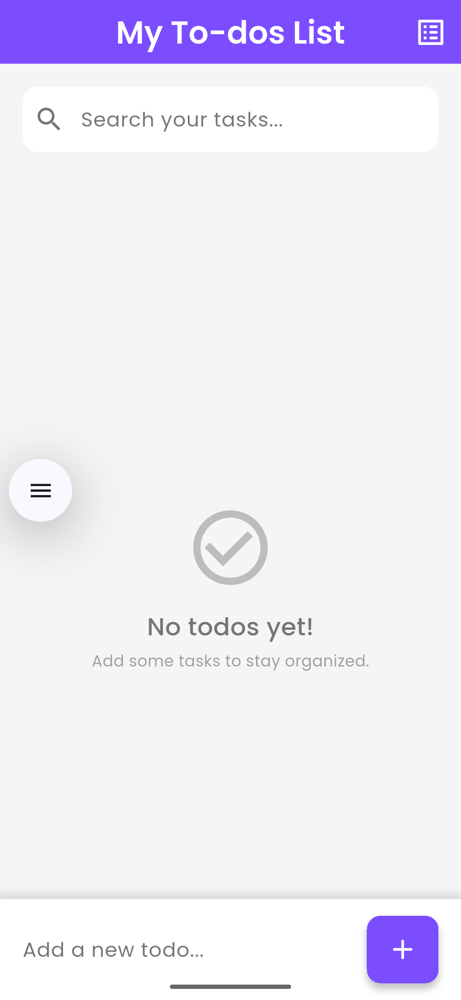
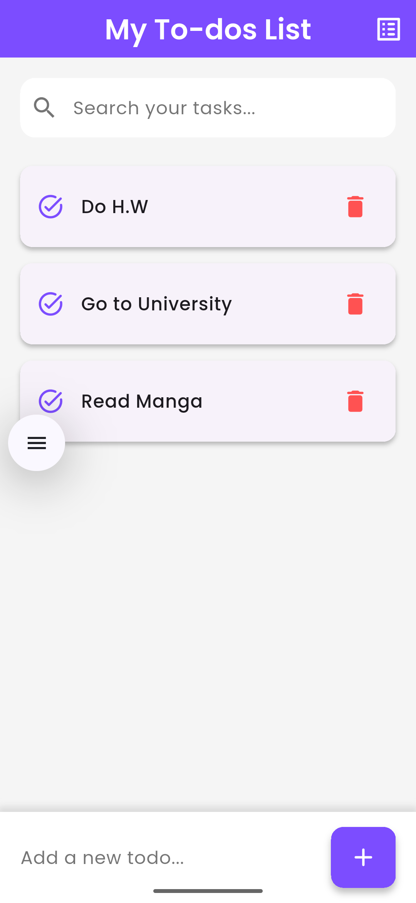

# 📋 My To-dos List

A simple and elegant To-do List mobile application built with **Flutter**. This app allows users to manage daily tasks with ease using a beautiful and intuitive user interface.

## ✨ Features

* 📌 Add new tasks
* ✅ Mark tasks as complete
* ❌ Delete tasks
* 🔍 Search through tasks
* 📱 Mobile-friendly UI with smooth interactions
* 📎 Local state management (can be extended with persistent storage)

## 📸 Screenshots

| Empty State                                                 | With Tasks                                                 |
|-------------------------------------------------------------|------------------------------------------------------------|
|   |   |

> 📁 *Place your screenshots in a **`screenshots`** folder inside the root directory for them to show properly.*

## 🚀 Getting Started

### Prerequisites

* Flutter SDK installed: [Flutter Install Guide](https://flutter.dev/docs/get-started/install)
* A code editor (VS Code / Android Studio recommended)

### Run Locally

```bash
git clone https://github.com/OnoPUNPUN/todo_app.git
cd flutter-todo-app
flutter pub get
flutter run
```

## 🛠 Built With

* [Flutter](https://flutter.dev/)
* Dart

## 📌 Todo (Future Improvements)

* Add persistent storage (e.g., Hive, SQLite, Firebase)
* Add dark mode support
* Add due dates and reminders
* Allow sorting/filtering by status

## 🙌 Contribution

Pull requests are welcome. For major changes, please open an issue first to discuss what you'd like to change.

---

Made with ❤️ by Tonmoy
